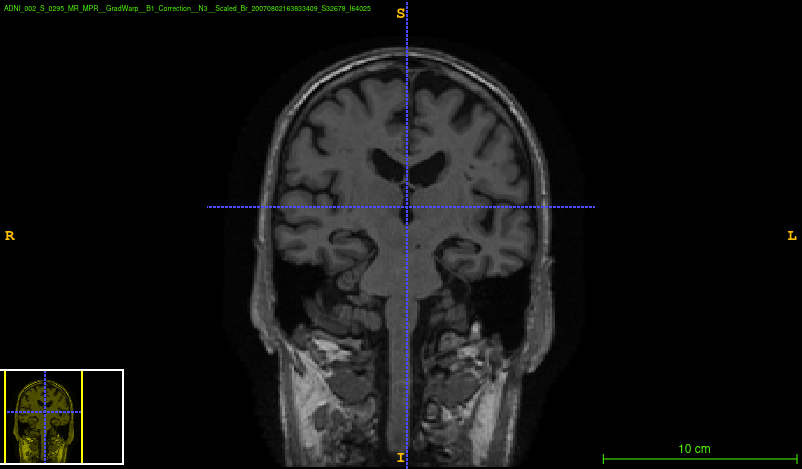
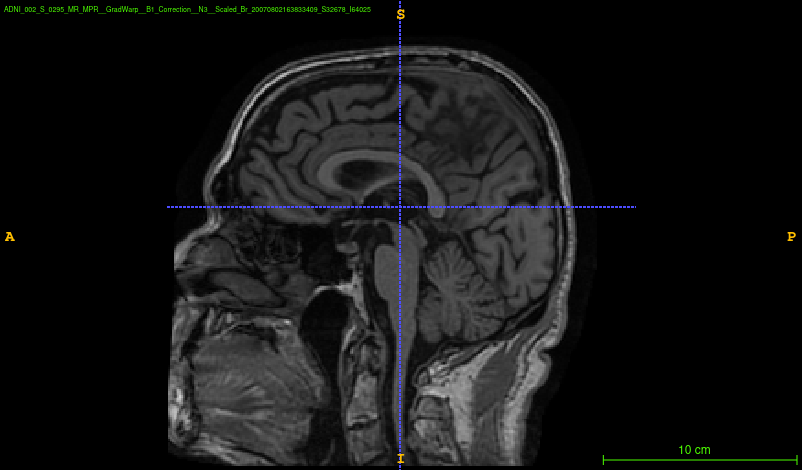
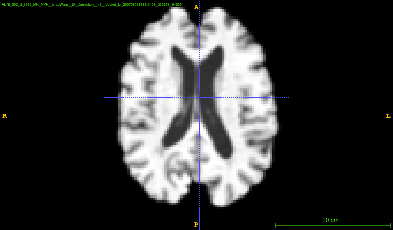
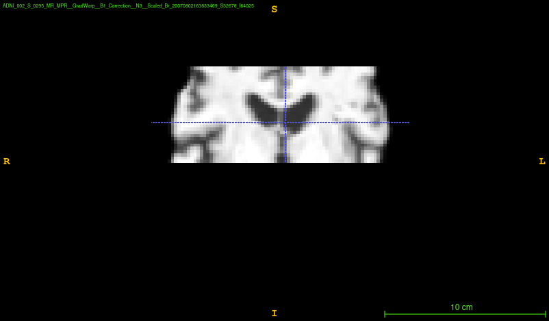
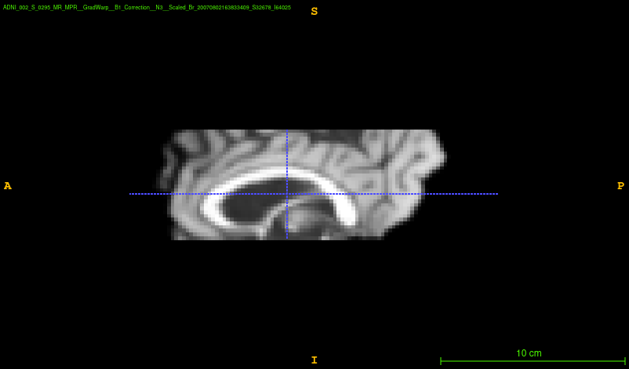
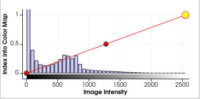
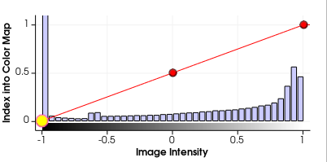

README.md

# ADNI dataset imaging preprocessing

Alzheimer’s Disease Neuroimaging Initiative **ADNI** T1-weighted MRI pre-processing for deep learning pipelines. Huge thanks to [Tian Xia](https://github.com/xiat0616) for sharing initial code.

### Raw data

  

### Preprocessed data
     

### Histograms

   
 ------->    
 

   

## Processing steps

1. Reorientation (FSL fslreorient2std)
2. Cropping (FSL robustfov)
3. Brain Extraction (FSL bet)
4. Atlas Affine Registration (FSL flirt)
    1. Resolution (1 or 2 mm) can be chosen at this step
5. Structure segmentation and bias correction (FSL fast)
6. Intensity normalization between [-1,1]
    1. Clip intensity at 99.5% of max values (numpy.percentile)
7. Central slice cropping. Default to 60mm around the centre along the z axis.

##  Downloading the data

For downloading the dataset, we refer the user to the [ADNI website ](http://adni.loni.usc.edu). You will need to apply for the data with a brief description of your project. Upon acceptance (which should take only a few days), you will download the images through the [LONI Image and Data Archive](https://ida.loni.usc.edu). After login in and selecting the ADNI dataset, you will need to download at least two files:

 1. Summary spreadsheet
    1. Download > Study Data > Data&Database > Key ADNI tables merged into one table (file)
 2. MRI Images
    1. Download > Image Collections > Other Shared Collections
        1. ADNI1_Screening_1.5T
        2. ADNI1_Complete_1Yr_1.5T
        3. ADNI1_Complete_2Yr_1.5T
        4. ADNI1_Complete_3Yr_1.5T

Unzip the imaging folders and save them in a single folder called "raw_data" which will have the following structure:

    raw_data/<subject_id>/<preprocessing>/<date>/<acquisition_id>/<file_name>.nii

## Dependencies

Create a [conda environment](https://conda.io/projects/conda/en/latest/user-guide/tasks/manage-environments.html) with

    conda env create -f environment.yml

then, activate the environment with

    conda activate adni

Most image processing methods were done using using the [FSL Neuroimaging](https://fsl.fmrib.ox.ac.uk/fsl/fslwiki/FSL) tool. You may install it by running:

    python2 fsl_ubuntu/fslinstaller.py

or by following the instructions [here](https://fsl.fmrib.ox.ac.uk/fsl/fslwiki/FslInstallation).

